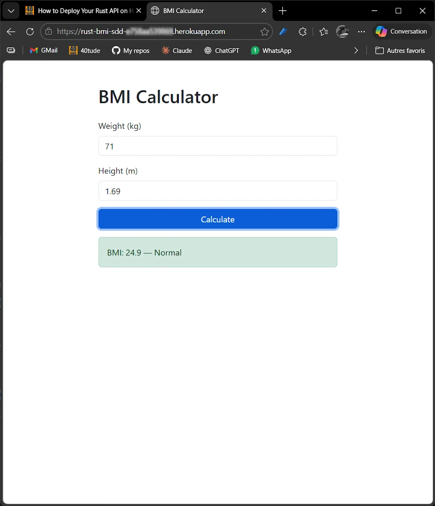

# bmi_sdd

> **Warning:** The `.cargo/` folder contains Windows-specific configuration (custom `target-dir` for OneDrive, CPU flags). Delete or rename before building:
> ```bash
> mv .cargo .cargo.bak
> ```
> More information on this [page](https://www.40tude.fr/docs/06_programmation/rust/005_my_rust_setup_win11/my_rust_setup_win11.html#onedrive).


## Description

* This is one of the projects I plan to use to illustrate a blog post about "SDD in Rust using Spec Kit".
* SDD = Spec Driven Development
* The aim is to apply the Spec Kit workflow to create a simple BMI Calculator web application in Rust.

<div align="center">
<br/>
<!-- <span>Optional comment</span> -->
</div>

## Core Functionality

* Calculate Body Mass Index (BMI) using SI units (kg for weight, meters for height)
* Classify BMI into standard WHO categories:
    * Underweight: < 18.5
    * Normal: 18.5 – 24.9
    * Overweight: 25.0 – 29.9
    * Obese: ≥ 30.0
* Stateless application — no database, no persistence


## API

* Single endpoint: `POST /api/bmi`
    * Request body (JSON): `{ "weight_kg": f64, "height_m": f64 }`
    * Success response (200): `{ "bmi": f64, "category": "string" }`
    * Error response (422): `{ "error": "string" }` with meaningful messages (e.g., `"weight_kg must be positive"`)
* Health check: `GET /health` returning 200 OK


## Tech Stack & Crates

* **Web framework:** Axum + Tokio (async runtime)
* **Serialization:** Serde (JSON request/response)
* **Error handling:** thiserror (domain/library errors) + anyhow (application-level errors)
* **Logging:** tracing + tracing-subscriber — all errors logged server-side
* **CLI config:** Clap (port, log level)
* **HTTP client:** Reqwest (for integration tests)
* **UI:** Bootstrap (CDN), served as embedded HTML via Axum


## Architecture

* Clean separation: domain logic, API layer, UI serving
* Domain module: pure functions for BMI calculation and classification (no I/O, no framework dependencies)
* API module: Axum handlers, JSON types, input validation, error mapping
* UI module: single HTML page with Bootstrap form, fetch-based submission to `/api/bmi`, result display


## Quality & Testing (TDD)

* Unit tests for domain logic (calculation accuracy, category boundaries, edge cases like zero/negative inputs)
* Integration tests for API endpoints using Reqwest (valid requests, invalid inputs, missing fields)
* All tests runnable via `cargo test`


## Local Development

### Build

```bash
cargo build
```

### Run

```powershell
# Default port 3000
cargo run

# Custom port via CLI flag
cargo run -- --port 8080

# Custom port via env var (takes precedence over --port)
$env:PORT='8086'; cargo run; Remove-Item env:PORT
# CTRL+C to stop
Remove-Item env:PORT
ls env:

# PORT only exists for the spawned process
Start-Process cargo -ArgumentList 'run' -NoNewWindow -Wait -Environment @{ PORT = '8086' }


# Custom log level
cargo run -- --log-level debug
cargo run -- --log-level "bmi_sdd=debug,hyper=debug,tower=debug"
```

The server starts at `http://localhost:3000` (or the configured port).

### Test

```bash
# Run all tests (unit + integration)
cargo test

# Unit tests only (domain logic + port resolution)
cargo test --lib
cargo test --bin bmi_sdd

# Integration tests only
cargo test --test api_test
```

### Manual Verification

With the server running (`cargo run`):

```bash
# Valid BMI calculation
curl -X POST http://localhost:3000/api/bmi \
  -H "Content-Type: application/json" \
  -d '{"weight_kg": 70.0, "height_m": 1.75}'
# -> 200 {"bmi":22.9,"category":"Normal"}

# Invalid input
curl -X POST http://localhost:3000/api/bmi \
  -H "Content-Type: application/json" \
  -d '{"weight_kg": 0.0, "height_m": 1.75}'
# -> 422 {"error":"weight_kg must be positive"}

# Health check
curl http://localhost:3000/health
# -> 200 OK

# Web UI — open in browser
start http://localhost:3000
```

### Code Quality

```bash
cargo fmt
cargo clippy -- -D warnings
```


## Deployment to Heroku


### Prerequisites

- Run and test locally first
- Heroku CLI installed
- Heroku account
- Read `.slugignore` (avoid useless files on Heroku)
- Check the line `strip = "symbols"` in `Cargo.toml` (reduce size by removing symbol table entries from the final executable)


### Steps

1. Create a new Heroku app:
```bash
heroku create rust-bmi-sdd
```

2. Set the buildpack:
```bash
heroku buildpacks:set emk/rust
```

**Note:**
Combine 1 & 2 with

```bash
heroku create rust-bmi-sdd --buildpack emk/rust
```


3. Auth:
```powershell
heroku auth:token
```
Select and copy the token.


4. Deploy on Heroku:
```bash
git push heroku main
```
* When the dialog box popup, enter **ANY** name and paste the token.
* Files are sent, the build process starts and the server is launched.
* Note the URL (for example: https://rust-bmi-sdd-XXXX.herokuapp.com/)

5. Open the app:
```bash
heroku open
```
Alternatively point your browser to the previous URL (for example: https://rust-bmi-sdd-XXXX.herokuapp.com/)

**Note:**
Use
```bash
heroku run bash
```
* To check the files deployed on Heroku.
* To check the size of the binary use `ls -al ./target/release/`


**Note:**
The process should be:
- Add features with Spec Kit, modify the app with Claude, test locally etc.
- Commit & push on GitHub
- Push on Heroku


## Non-goals

* No input range constraints beyond positivity
* No persistence or database
* No API versioning
* No authentication


## License

MIT License - see [LICENSE](LICENSE) for details


## Contributing

This project is developed for personal and educational purposes. Feel free to explore and use it to enhance your own learning.

Given the nature of the project, external contributions are not actively sought nor encouraged. However, constructive feedback aimed at improving the project (in terms of speed, accuracy, comprehensiveness, etc.) is welcome. Please note that this project is being created as a hobby and is unlikely to be maintained once my initial goal has been achieved.